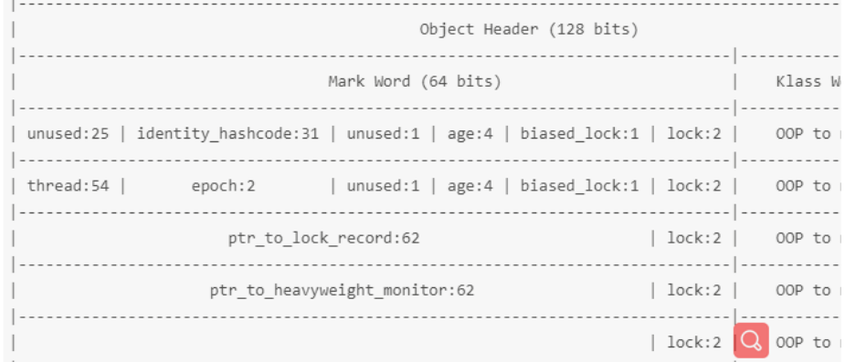

#线程同步的方法:sychronized,lock,reentrantLock,Condition等

##在讲解之前 先要了解java线程和os线程的关系
java中的线程和os 中的线程是一一对应的
```java
/**
 * @Author: small_double
 * @Date: 2019/9/23 下午4:16
 * 自定义一个 开启一个线程的类  不经过jvm
 */
public class ThreadLee {

    static {
        System.loadLibrary("LeeThreadNative");
    }
    public static void main(String[] args) {
        ThreadLee threadLee = new ThreadLee();
        threadLee.start0();

    }
    //  //这个run方法，要让C程序员调用到，就完美了
    // java  --> new object  --> obj.method()
    //  c  --> JNIEnv-->  获取java虚拟机 -->new obj-->obj.method
    //  以下是  c代码  
    // java 虚拟机去  Jclass cls = findClass
    // ->Jmethod cid = GetMethodId(env,cls,"<init>","()V") 找到无参构造方法
    // ->Jobject obj = NewObject(env,cls,cid);  new  obj
    // ->Jmethod mid = GetMethodId(env,cls,"run","()V")找到 run方法
    // ->  CallIntMethod(env,obj,mid,NULL) 回调run()方法
    //
    public void run(){
        System.out.println("I am Thread");
    }
    // 调用本地方法，  2
    //这个方法要参考.h文件的15行代码，这里的参数得注意，你写死就行，不用明白为什么
    //JNIEXPOR void JNICALL Java_com_LeeThread_start0
    //        (JNIEnv *env, jobject c1){
    //    pthread_create 第三个参数 就是方法体 及 run方法   start_thread()
    //       pthread_create(&pid,NULL,thread_entity,NULL);
    //   利用JNI  c 反调 java 程序 

    private native void start0();
}
```
## thread.start() 调用 run方法的原理
java中`start`方法会调用`native void start0()`本地方法,这实际上就是以个c文件，存放在java.exe中，在c中
我们调用pthread_create(pthread_t *thread, const pthread_attr_t *attr,
                                             void *(*start_routine) (void *), void *argL)方法，
这个方法是os创建线程的方法，第三个参数我们start_thread()方法，利用JNI 调用run() 方法。                                        


## wait 与while 配合使用
```java
public class Demo1 {
    public static boolean flag = true;
    public void test() throws InterruptedException {
        synchronized (this){
            while (flag) {
                //...
                this.wait();
                // 这里会存在多个等待线程
                // 当其他线程调用notifyAll()方法时会同时唤醒多个线程
                // 如果用if判断的话，就会直接运行下面的流程，而当唤醒的第一个
                // 线程执行完，第二个线程应该在判断一次条件是否符合。
                //logic  process
            }
            flag = false;
        }
    }
}
```


## synchronized
java 对象头，sync 对象锁住的其实就是对象头

在对象头中，一共存在128个bit位，及16个字节，其中Mark word 64bit，Klass 64bit(可能存在指针压缩)

`Mark word `中,unused 25 bit , hash 31 bit ,| unused 1  age 4 biased_lock 1 lock 2


- 无锁    001

- 偏向锁  101
    jvm会`延迟加载`偏向锁，大约4s的时间;
    轻量锁与hashcode不能同时存在，是互斥的。当开启偏向锁时,但是并没有线程持有时，偏向锁存在一个可偏向状态，
- 轻量锁  00
    在多线程交替执行时并不会出现重量锁，而是轻量锁，
- 重量锁  10
    多线程互斥执行时会出现重量锁，使用wait操作时会直接变成重量锁。
- gc     11

### 锁的膨胀过程
偏向锁一般情况下只能在偏向自己，
1.当有第二个线程交替执行时，一般会膨胀成轻量锁，特殊情况如第一个线程执行完释放时，第二
个线程获取到的线程id还是第一个线程的id，这样看起来是一种重偏向，其实还是一直偏向自己。
2.当同一个对象连续膨胀为轻量锁约20次时，jvm就会认为当前对象存在问题，会修改对象头中的epoch值，这时会会存在批量
偏向的现象，前20个还是轻量锁，但后面的会重偏向第二个线程。


