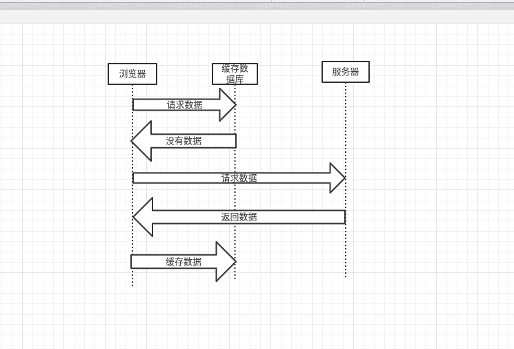
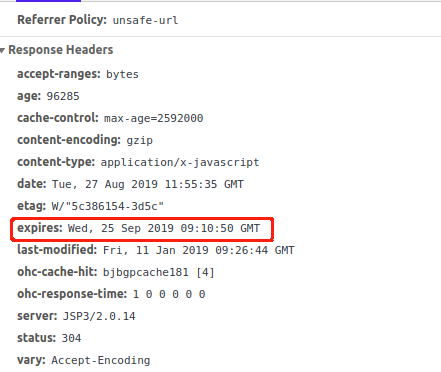
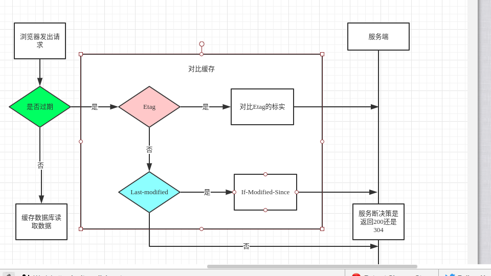

# HTTP缓存

为了方便理解，我们假设`浏览器`和`服务器`之间存在一个`缓存数据库`

缓存 大体 分为 `强制缓存`和`对比缓存`两类

## 强制缓存
强制缓存是在缓存已存在且未失效的情况下直接去缓存数据库获取数据
### 如何判断缓存失效
-  Response Header 中的`expires`字段

在`第一次`请求数据的时候，服务器在返回缓存规则时会在header中标实过期
时间expires，在下一次请求时，请求时间小于服务端返回的到期时间，直接使用
缓存数据。

- Response Header 中的 `Cache-Control`字段

现在Http1.1默认使用Cache-Control 字段，因为客户端浏览器和服务端的时间
可能存在偏差，这就会导致缓存的误差。

`private`:             客户端可以缓存

`public`:              客户端和代理服务器都可缓存

`max-age=xxx`:   缓存的内容将在 xxx 秒后失效

`no-cache`:          需要使用`对比缓存`来验证缓存数据

`no-store`:           所有内容都不会缓存，强制缓存，对比缓存都不会触发

## 对比缓存
对比缓存在缓存已存在的情况下，先去缓存数据库获取数据标实，然后去服务器验证标实
是否已经失效，`没失效`则去缓存数据库获取数据，`失效`则服务器会直接获取`新数据`和`缓存规则`，然后浏览器
在将新的`数据`缓存至`缓存数据库`

服务端在进行标识比较后，只返回`header`部分，通过`状态码302`通知客户端使用缓存，
不再需要将`报文主体`部分返回给客户端。

 - Last-Modified（第一次）  /  If-Modified-Since
        
        根据资源最后的修改时间 TODO
 - Etag （第一次） /  If-None-Match
        
        根据资源标实 比 Last-Modified优先级高 TODO

## 总体流程

<footer>
    参考 https://www.cnblogs.com/chenqf/p/6386163.html
</footer>